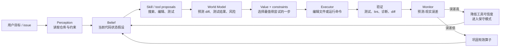

# Prefrontal-Cortex

一个**可运行**的 World Model Agent 架构，以及它相对「skill + 角色扮演」范式的对照实验。

零第三方依赖，纯标准库，Python 3.9+。

```bash
python bench.py                 # 训练分布
python bench.py --ood           # 分布外：更大拓扑 + 更高噪声
python meta_demo.py             # 元认知专项：世界出现模型没见过的东西时
python bench.py --misspecify    # 模型与现实不一致（结果见下方「诚实的局限」）
python sweep.py                 # 训练集上的超参网格（不得用测试集调参）
python tests/run_tests.py       # 单元测试（零依赖，无需 pytest）

# 直接运行伪代码对应的闭环
python -m wm.code_loop
```

伪代码的可运行实现位于 [`wm/code_loop.py`](wm/code_loop.py)。它把
`imagine.generate`、`simulator.rollout`、`evaluator.score` 和 `search.select`
交给现有的 `WMAgent -> MCTSPlanner`，再把 `executor.commit`、预测误差和
`learner.update` 接回 `OpsWorld`、`ModelMonitor` 与 `SkillCompiler`。

### Codex / Workbuddy 工作流映射图

这张图展示一个编码型 Workbuddy 如何使用同一套世界模型：技能只负责
提出候选，模型负责预测，工具执行后必须重新观测并对账。



---

## 一、为什么 skill + role-playing 结构上不够

前提：Agent = **技能**（固定触发变套路）+ **角色扮演**（prompt 注入的行为先验）。这两者都不建模
*世界如何随动作变化*，于是以下能力**不是没做好，而是无从产生**：

| 缺失项             | 后果                                                                              |
| ------------------ | --------------------------------------------------------------------------------- |
| 无`P(s' \| s, a)` | 不能问「如果这么做会怎样」，只能问「接下来该做什么」→ 规划退化为 depth-1 贪心    |
| 无潜状态信念       | 不确定性隐含在上下文里，无法被度量，也就无法被**主动消除**                  |
| 无`P(o \| s')`    | 无法把「预测」与「现实」对账 → 不存在 surprise → 会带着错误的世界理解一路走到底 |
| 技能之间不共享结构 | N 个技能只能覆盖 N 类情境，遇到第 N+1 类就直接失败                                |
| 没有 backup 机制   | 走错的分支不会被追溯地降权，错误没有归因对象                                      |

**一句话**：它是 policy-only 的。它把全部智力押在「这一步看起来对不对」上，
而把「这一步在五步之后会不会导致麻烦」这个问题留给了运气。

---

## 二、架构：六个必备模块

```
                        ┌─────────────────────────────────────────┐
   观测 o_t ───────────▶│ ① Perception / Belief Encoder            │
                        │    history → P(s | o₁…oₜ)  显式后验      │
                        └──────────────┬──────────────────────────┘
                                       │ belief bₜ（概率分布，不是文本）
                        ┌──────────────▼──────────────────────────┐
                        │ ④ Planner — 信念空间上的 MCTS            │
                        │    在模型内 rollout N×H，不触碰现实       │
                        └────────┬───────────────────┬────────────┘
                                 │ ask               │ ask
                   ┌─────────────▼──────┐   ┌────────▼──────────┐
                   │ ② Dynamics Model   │   │ ③ Goal / Value    │
                   │ T(s'|s,a) + P(o|s')│   │ achievement + 约束 │
                   └─────────────┬──────┘   └───────────────────┘
                                 │
   ⑥ Skill Grounding ──▶Operator┘      ▲
   技能在这里被降级：                │
   不再是决策者，而是编译产物          │ surprise = -log P(o)
                                       │
                        ┌──────────────┴──────────────────────────┐
                        │ ⑤ Meta-Cognition / Prediction Monitor   │
                        │   预测 vs 现实 → 算子可信度 / 保守度调节  │
                        └─────────────────────────────────────────┘
```

| 模块        | 文件                | 回答什么问题                                         |
| ----------- | ------------------- | ---------------------------------------------------- |
| ① 信念编码 | `wm/inference.py` | 我现在到底相信世界的哪些可能版本？各自多大概率？     |
| ② 动力学   | `wm/model.py`     | 在这个状态下做这个动作，世界会怎么变、我会看到什么？ |
| ③ 价值     | `wm/value.py`     | 一个信念值多少分？（含硬约束红线）                   |
| ④ 规划     | `wm/planner.py`   | 在想象里试 N×H 次之后，哪一步真正最优？             |
| ⑤ 元认知   | `wm/monitor.py`   | 我刚才的世界预测错在哪？错得多离谱？                 |
| ⑥ 技能落地 | `wm/grounding.py` | 这个技能说它能干什么 —— 实测它到底改变了什么？     |

以及 **技能的新位置**：`wm/proposal.py`。
技能不再是决策者，而是 (a) 候选动作生成器 (b) 结构化先验。裁决权移交给了「动力学 + 价值 + 搜索」。

---

## 三、核心机制：三个别人做不到的东西

### 1. 信息增益进了目标函数

```python
# wm/planner.py
r = λ_info · (H(b) − H(b'))  −  λ_cost · cost  −  λ_risk · risk · (2 − reliability)
```

于是一个**不改变外部世界、纯粹为了看清楚**的动作，第一次有了正价值。
这是 ReAct/CoT 结构上做不到的：它们没有任何机制为「先别动手，先看清楚」记账。

### 2. Bayes-adaptive rollout

```python
# wm/planner.py :: _rollout
h* = belief.sample()            # 采一个「真实世界」，只在想象中存在
for depth:
    h*  = transition(h*, a)     # 真实世界演化
    o   = emission(h*, a)       # 产生观测
    b'  = belief_update(b, a, o)# 但 agent 只能靠观测更新自己的信念副本
```

Zero-cost 试错：上千次失败发生在模型里，不调工具、不写文件、不可逆转。

### 3. surprise 闭环

```python
surprise = -log Σ_s P(o | s, a) b̄(s)
```

| surprise | 含义                 | 系统反应                                     |
| -------- | -------------------- | -------------------------------------------- |
| ≈ 0     | 观测完全在预期内     | 正常继续                                     |
| 突然变大 | 这一带的动力学是错的 | 下调该算子可信度 → planner 给它打折         |
| 持续变大 | 进入盲区             | 保守模式：副作用惩罚 ×2，信息增益权重 ×1.5 |

**这是防止「幻觉出一个自洽但错误的世界」的唯一诚实机制。**

---

## 四、实验：一个部分可观测的运维 POMDP

`envs/ops_world.py`。设计这个环境的理由写在文件头：

1. **部分可观测** —— 真正的根因看不见，只能靠带噪探针（10~12% 错误率）间接推
2. **动作有副作用** —— 乱重启会把依赖它的服务一起拖下水
3. **诊断比盲修便宜** —— 于是 information-seeking 行为有正价值

对照组不是稻草人（见 `baselines.py`）：

- `skill+roleplay` —— 装备了完整领域知识（哪个修复对应哪个故障），只缺「信念」
- `skill+roleplay(oracle)` —— **技能范式的上界**：连 OOD 新故障的正确修复技能都给了它
- `random` —— 下界，确认环境本身不是平凡的

所有 agent 在同一组 `(root, mode)` 案例上逐对比较、同一随机种子。
超参只在**训练集**上调（`sweep.py`），测试集一次跑完。

### 结果 1 · 主评测（sims=48，逐对同种子）

| 场景                     | agent                        | 成功率         | 总回报         | 步数  | 误修次数       | 连带损伤       |
| ------------------------ | ---------------------------- | -------------- | -------------- | ----- | -------------- | -------------- |
| 训练分布4服务/4故障16 例 | **World-Model**        | 100%           | **84.0** | 5.00  | **0.50** | 0.00           |
|                          | skill+roleplay               | 100%           | 72.9           | 4.00  | 2.00           | 0.00           |
|                          | skill+roleplay (oracle 上界) | 100%           | 72.9           | 4.00  | 2.00           | 0.00           |
|                          | random                       | 18.8%          | -50.4          | 11.25 | 3.69           | 0.25           |
| OOD7服务/6故障42 例      | **World-Model**        | 92.9%          | **67.5** | 8.50  | **0.67** | **0.00** |
|                          | skill+roleplay               | **100%** | 53.6           | 5.60  | 3.60           | 0.55           |
|                          | skill+roleplay (oracle 上界) | **100%** | 53.6           | 5.60  | 3.60           | 0.55           |
|                          | random                       | 11.9%          | -66.1          | 13.00 | 4.17           | 0.95           |

** 分析 **：

- 训练分布上 World Model 全面占优：总回报 +11.1，误修从 2.00 降到 0.50，**零连带损伤**。
- OOD 上**对照组的成功率更高（100% vs 92.9%）**。它靠穷举所有猜测把 horizon 用满，
  代价是 3.60 次误修 + 0.55 次连带损伤；World Model 的失败模式是**没在 horizon 内修完**，
  不是**修错**。
- 这是「少犯错 vs 一定期限内解决」的权衡，**不是全面碾压**。误修代价高的场景
  （生产环境、不可逆操作、有真实用户受影响）前者更优；"先跑通再说"的场景后者够用。

### 结果 2 · 元认知专项（`meta_demo.py`）

设定：**双方都**不知道这两种故障（WM 的先验假设空间被收窄；对照组的技能库也被同等收窄）。
比的不是谁修得好（都修不好），而是「会不会表现出不知道」。

| 指标          | World-Model Agent      | skill+roleplay |
| ------------- | ---------------------- | -------------- |
| 修复成功率    | 0.14                   | 0.00           |
| 平均误修次数  | **3.86**         | 13.00          |
| 平均连带损伤  | **0.00**         | 2.29           |
| 平均总回报    | **-65.6**        | -172.7         |
| 平均 surprise | **2.84 nats**    | 无此量         |
| 触发保守模式  | **10 / 14 回合** | 无此机制       |

样本回合里可以看到机制在工作：

```
t07 H=1.07 → restart(gateway)         (reward -13.0)  surprise= 2.01
t10 H=1.07 → rollback_config(gateway) (reward -10.0)  surprise= 5.13
t12 H=1.15 → rollback_config(gateway) (reward -10.0)  surprise= 6.73

模型不可靠区域（按 surprise 排序）：
  rollback_config  surprise_ema=3.52  reliability=0.20   ← 已跌到地板
  patch            surprise_ema=2.19  reliability=0.20
```

对照组在同一处境下执行了 **13 次**无效且带副作用的修复，且**对外表现与胸有成竹时毫无区别** ——
这不是它不够聪明，而是它的结构里**根本没有可以被推翻的预测**。

### 结果 3 · `--misspecify`

**这个实验基本是空转的，如实交代。** 让模型错估「错误维修的级联副作用概率」（0.02 vs 真实 0.50），
结果总回报 83.8 vs 84.0 —— 差异淹没在噪声里。

原因是： planner 的谨慎策略已经把误修压到 0.5 次/回合，级联副作用**很少有被触发的机会**。
换句话说，**好的规划会减少对模型误差的暴露面**。要从 ppm 层面彰显错配的代价，
需要一个「无法回避该动作」的环境。机制本身是可用的，见单元测试
`test_monitor_detects_misspecification` 与上面 `meta_demo` 的 reliability 崩塌曲线。

---

## 五、未解决问题

以后的版本更新会更新：

1. **先验假设空间是枚举的**。潜状态必须能被写成离散组合，这里靠<｜hy_place▁holder▁no▁813｜> rationality 手工给。
   真正的 Agent 场景（代码库、浏览器）状态空间是开放的 —— 需要 hypothesis generation，
   本实现**没有**做，这是最大的缺口。
2. **符号动力学来自人工注入**（`build_operators`）。`SkillCompiler` 能从轨迹归纳
   precondition/effect，但只在 toy 上验证过。
3. **没接真 LLM**。`wm/llm.py` 留了 OpenAI 兼容后端，但架构默认跑符号路径。
   LLM 的合理位置是 proposal + 未知转移的 residual prior，不是决策主体 —— 这一点未被验证。
4. **`--misspecify` 实验基本空转** —— 见上文「结果 3」。错配检测机制本身可用（有单测与 meta_demo 佐证），
   但在当前环境下效果被淹没在噪声里。这是环境设计问题，不是机制无效。
5. **算子是 Markov 的**，没有时间抽象（options / temporal abstraction），长链条任务会退化。
6. **计算代价**：每次决策 N×H 次 rollout（本环境里约 0.1–0.3 秒/次决策）。
   这是 model-based 方法的固有消费税，在真实场景里只有当动作本身足够慢/贵/不可逆时才划算。

---

## 六、目录

```
wm/           核心库（六个模块）
envs/
  ops_world.py   POMDP 环境 + Agent 侧世界模型 + 组装函数
baselines.py   对照组（含 oracle 上界版）
runner.py      回合驱动器（bench 与 demo 共用）
bench.py       评测入口
sweep.py       训练集超参网格
tests/         单元测试（断言的是能力，不只是不崩）
```
